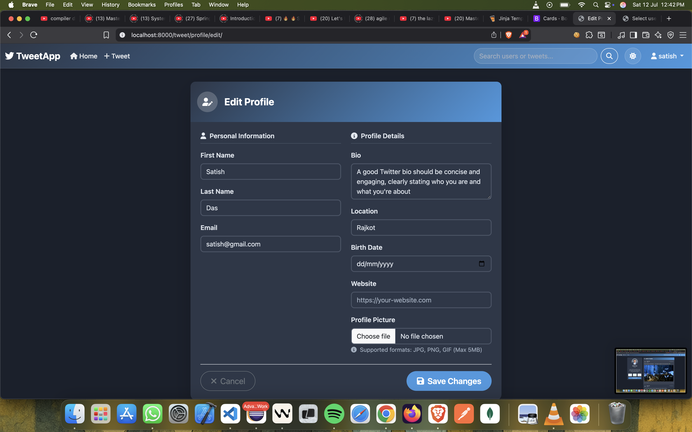

# 🐦 Tweet Application

A feature-rich Django-based Twitter-like social media *Application interface in light theme mode*

## 📋 Future Enhancementsilt with modern web technologies. This application provides a complete social media experience with user authentication, tweet management, social interactions, and a beautiful responsive interface.

## 🚀 Live Demo

Access the application at: `http://127.0.0.1:8000/tweet/`

**Demo Credentials:**
- **Admin**: `admin` / `admin123`
- **Test Users**: `user1`, `user2`, `user3` / `password123`

## ✨ Features Overview

### 🔐 **Authentication & User Management**
- [x] **User Registration**: Complete signup process with email validation
- [x] **User Login/Logout**: Secure authentication system
- [x] **Session Management**: Proper login redirects and session handling
- [x] **User Profile System**: Comprehensive profile management

### 🐦 **Tweet Management**
- [x] **Create Tweets**: Text and photo tweet creation
- [x] **Edit/Delete Tweets**: Full CRUD operations with ownership validation
- [x] **Tweet Timeline**: Chronological tweet display with infinite scroll
- [x] **Tweet Details**: Individual tweet pages with enhanced viewing

### 👥 **Social Features**
- [x] **User Profiles**: Complete profile system with avatars, bio, stats
- [x] **Follow/Unfollow**: Social networking functionality
- [x] **Like System**: Like/unlike tweets with AJAX support and real-time updates
- [x] **Comment System**: Threaded discussions on tweets
- [x] **Search Functionality**: Search for users and tweets with advanced filters

### 🎨 **UI/UX Excellence**
- [x] **Responsive Design**: Mobile-first Bootstrap 5.3.7 interface
- [x] **Modern UI**: Professional styling with custom CSS variables
- [x] **Enhanced Navigation**: Intuitive navbar with user dropdown
- [x] **Interactive Elements**: Smooth animations and transitions
- [x] **Accessibility**: ARIA labels and semantic HTML

### 🔧 **Technical Features**
- [x] **AJAX Integration**: Real-time interactions without page refresh
- [x] **Image Handling**: Photo upload for tweets and profile avatars
- [x] **Database Optimization**: Efficient queries and relationships
- [x] **Error Handling**: Robust error management and user feedback
- [x] **Security**: CSRF protection and secure authentication

## � Screenshots

### 🏠 **Homepage & Timeline**

*Main timeline showing tweets with modern card-based design*

### 🔐 **Authentication**

*Clean and professional login interface*


*User registration with form validation*

### 👤 **User Profile**

*Complete user profile with tweets, stats, and follower information*

### � **Social Features**

*Threaded comment discussions on tweets*

### 👤 **Profile Management**

*Profile editing interface with form controls*

### 🔍 **Search & Navigation**

*Advanced search for users and tweets*

### 🌞 **Light Mode**

*Application interface in light theme mode*

### 📱 **Mobile Responsive**

*Mobile-optimized timeline view*


*Responsive user profile on mobile devices*

### ⚙️ **Admin Interface**

*Django admin interface for content management*


## 🏗️ Project Architecture

```
tweet_application/
├── 📄 README.md                    # Project documentation
├── 📄 requirements.txt             # Python dependencies
├── 📁 .venv/                       # Virtual environment
├── 📁 .git/                        # Git repository
└── 📁 tweet_app/                   # Main Django project
    ├── 🗄️ db.sqlite3               # SQLite database
    ├── ⚙️ manage.py                 # Django management script
    ├── 📁 media/                   # User uploaded files
    │   ├── 📁 photos/              # Tweet images
    │   └── 📁 avatars/             # User profile pictures
    ├── 📁 templates/               # Global templates
    │   ├── 🎨 layout.html          # Base template with Bootstrap
    │   ├── 🏠 index.html           # Landing page
    │   └── 📁 registration/        # Authentication templates
    │       ├── 🔐 login.html       # Login page
    │       ├── 📝 register.html    # Registration page
    │       └── 👋 logged_out.html  # Logout confirmation
    ├── 📁 tweet/                   # Main application
    │   ├── 🔧 models.py            # Data models (Tweet, UserProfile, Like, Comment)
    │   ├── 📋 forms.py             # Django forms
    │   ├── 👁️ views.py             # Business logic and controllers
    │   ├── 🌐 urls.py              # URL routing
    │   ├── ⚙️ admin.py             # Admin interface configuration
    │   ├── 📁 templates/           # App-specific templates
    │   │   ├── 📰 tweet_list.html  # Main timeline
    │   │   ├── 📝 tweet_form.html  # Tweet creation/editing
    │   │   ├── 📄 tweet_detail.html # Individual tweet view
    │   │   ├── 👤 profile.html     # User profile page
    │   │   ├── ✏️ profile_edit.html # Profile editing
    │   │   └── 🔍 search.html      # Search results
    │   ├── 📁 migrations/          # Database migrations
    │   └── 📁 templatetags/        # Custom template tags
    └── 📁 tweet_app/               # Django project settings
        ├── ⚙️ settings.py          # Configuration
        ├── 🌐 urls.py              # Main URL configuration
        ├── 🚀 wsgi.py              # WSGI server configuration
        └── 🔄 asgi.py              # ASGI server configuration
```

## 🛠️ Technology Stack

### **Backend Technologies**
- **Framework**: Django 5.2.4 (Python web framework)
- **Database**: SQLite3 (Development) / PostgreSQL (Production ready)
- **Image Processing**: Pillow 11.3.0 (Image handling and manipulation)
- **Authentication**: Django's built-in authentication system
- **ORM**: Django ORM for database interactions

### **Frontend Technologies**
- **CSS Framework**: Bootstrap 5.3.7 (Responsive UI components)
- **Icons**: Font Awesome 6.4.0 (Comprehensive icon library)
- **JavaScript**: Vanilla JS with AJAX for dynamic interactions
- **Templating**: Django Template Language (DTL)

### **Development Tools**
- **Version Control**: Git
- **Package Manager**: pip
- **Environment**: Virtual environment (.venv)
- **Development Server**: Django's built-in server

## 📊 Database Schema

### **Core Models**

#### **Tweet Model**
```python
class Tweet(models.Model):
    user = models.ForeignKey(User, on_delete=models.CASCADE)
    text = models.TextField(max_length=240)
    photo = models.ImageField(upload_to='photos/', blank=True, null=True)
    created_at = models.DateTimeField(auto_now_add=True)
    updated_at = models.DateTimeField(auto_now=True)
    
    # Properties
    likes_count = property(lambda self: self.likes.count())
    comments_count = property(lambda self: self.comments.count())
```

#### **UserProfile Model**
```python
class UserProfile(models.Model):
    user = models.OneToOneField(User, on_delete=models.CASCADE)
    bio = models.TextField(max_length=500, blank=True)
    location = models.CharField(max_length=30, blank=True)
    birth_date = models.DateField(null=True, blank=True)
    avatar = models.ImageField(upload_to='avatars/', blank=True, null=True)
    website = models.URLField(blank=True)
    followers = models.ManyToManyField(User, related_name='following', blank=True)
    created_at = models.DateTimeField(auto_now_add=True)
    updated_at = models.DateTimeField(auto_now=True)
```

#### **Like Model**
```python
class Like(models.Model):
    user = models.ForeignKey(User, on_delete=models.CASCADE)
    tweet = models.ForeignKey(Tweet, on_delete=models.CASCADE, related_name='likes')
    reaction_type = models.CharField(max_length=10, choices=REACTION_CHOICES, default='like')
    created_at = models.DateTimeField(auto_now_add=True)
    
    class Meta:
        unique_together = ('user', 'tweet')
```

#### **Comment Model**
```python
class Comment(models.Model):
    user = models.ForeignKey(User, on_delete=models.CASCADE)
    tweet = models.ForeignKey(Tweet, on_delete=models.CASCADE, related_name='comments')
    text = models.TextField(max_length=280)
    created_at = models.DateTimeField(auto_now_add=True)
    updated_at = models.DateTimeField(auto_now=True)
```

## 📱 User Interface Features

### **Responsive Design**
- Mobile-first approach with Bootstrap grid system
- Adaptive layouts for desktop, tablet, and mobile
- Touch-friendly interface elements
- Optimized image loading and display

### **Modern UI Components**
- **Navigation**: Collapsible navbar with user dropdown
- **Cards**: Modern card-based layout for tweets
- **Forms**: Styled form controls with validation
- **Buttons**: Consistent button styling with hover effects
- **Modals**: Interactive dialogs for confirmations

### **Interactive Elements**
- **AJAX Likes**: Real-time like/unlike without page refresh
- **Smooth Animations**: CSS transitions and hover effects
- **Dynamic Content**: JavaScript-powered interactions
- **Responsive Images**: Optimized image display

## 🔐 Security Features

### **Authentication & Authorization**
- **CSRF Protection**: Cross-site request forgery protection
- **Session Management**: Secure session handling
- **Password Hashing**: Django's built-in password hashing
- **User Permissions**: Ownership-based access control

### **Data Validation**
- **Form Validation**: Client and server-side validation
- **File Upload Security**: Restricted file types and sizes
- **Input Sanitization**: XSS protection
- **Database Constraints**: Model-level data integrity

## 🌐 API Endpoints

### **Authentication URLs**
- `POST /accounts/login/` - User login
- `POST /accounts/logout/` - User logout
- `GET /accounts/password_change/` - Password change form
- `POST /accounts/password_change/` - Password change submission

### **Tweet URLs**
- `GET /tweet/` - Tweet timeline (home page)
- `GET /tweet/create/` - Tweet creation form
- `POST /tweet/create/` - Tweet creation submission
- `GET /tweet/<int:tweet_id>/` - Tweet detail view
- `GET /tweet/<int:tweet_id>/edit/` - Tweet edit form
- `POST /tweet/<int:tweet_id>/edit/` - Tweet edit submission
- `POST /tweet/<int:tweet_id>/delete/` - Tweet deletion
- `POST /tweet/<int:tweet_id>/like/` - Like/unlike tweet (AJAX)

### **User & Profile URLs**
- `GET /tweet/register/` - User registration form
- `POST /tweet/register/` - User registration submission
- `GET /tweet/profile/` - Current user profile
- `GET /tweet/profile/<str:username>/` - User profile by username
- `GET /tweet/profile/edit/` - Profile edit form
- `POST /tweet/profile/edit/` - Profile edit submission
- `POST /tweet/follow/<str:username>/` - Follow/unfollow user

### **Search URLs**
- `GET /tweet/search/` - Search interface
- `GET /tweet/search/?q=<query>` - Search results
    │   ├── urls.py                 # URL routing for tweet app
    │   ├── tests.py                # Test cases
    │   ├── templates/              # App-specific templates
    │   │   ├── index.html          # Home page template
    │   │   ├── tweet_list.html     # Enhanced tweet listing page
    │   │   ├── tweet_form.html     # Tweet create/edit form
    │   │   ├── tweet_confirm_delete.html # Delete confirmation
    │   │   ├── profile.html        # User profile page
    │   │   └── profile_edit.html   # Profile editing form
    │   └── migrations/             # Database migrations
    │       └── __init__.py
    └── tweet_app/                  # Project settings directory
        ├── __init__.py
        ├── asgi.py                 # ASGI configuration
        ├── settings.py             # Django settings
        ├── urls.py                 # Main URL configuration
        ├── wsgi.py                 # WSGI configuration
        └── __pycache__/            # Python cache files
```

## Current Implementation Status

### ✅ Completed Features
- [x] Django project initialization
- [x] Basic project structure setup
- [x] Virtual environment configuration
- [x] Static files configuration
- [x] Media files configuration
- [x] SQLite database setup
- [x] Admin interface setup
- [x] **Tweet Model**: Complete with user association, text, photo, timestamps
- [x] **User Profile Model**: Bio, avatar, location, birth date, website, follower system
- [x] **Tweet Forms**: ModelForm for creating and editing tweets
- [x] **User Registration Form**: Custom registration form with email field
- [x] **Profile Forms**: User profile and user update forms with Bootstrap styling
- [x] **Tweet Views**: Full CRUD operations (Create, Read, Update, Delete)
- [x] **Profile Views**: Profile view, edit profile, follow/unfollow functionality
- [x] **Authentication Views**: Login, logout, registration functionality
- [x] **URL Routing**: Complete routing for all views including profiles
- [x] **Admin Integration**: Tweet and UserProfile models registered in admin panel
- [x] **Bootstrap 5.3.7 Integration**: Modern responsive UI framework
- [x] **Font Awesome Integration**: Icons for enhanced UI experience
- [x] **Template Structure**: Complete template system with authentication and profiles
- [x] **Media Handling**: Photo upload for tweets and profile avatars
- [x] **User Authentication**: Login/logout/registration system
- [x] **Session Management**: Proper login redirects and session handling
- [x] **Profile Management**: Complete user profile system with avatars and bio
- [x] **Follow System**: Users can follow/unfollow each other
- [x] **Enhanced Navigation**: Modern navbar with user dropdown and icons
- [x] **Responsive Design**: Mobile-friendly interface with Bootstrap grid


## Technologies Used

- **Backend**: Django 5.2.4
- **Database**: SQLite3
- **Frontend**: Bootstrap 5.3.7 (CDN), Font Awesome 6.4.0 (CDN)
- **Image Processing**: Pillow 11.3.0
- **Python**: Python 3.13
- **Environment**: Virtual environment (.venv)

## Dependencies

Current dependencies as listed in `requirements.txt`:
```
asgiref==3.9.1
Django==5.2.4
pillow==11.3.0
sqlparse==0.5.3
```

## Configuration Details

### Django Settings
- **Debug Mode**: Enabled for development
- **Installed Apps**: Tweet app added to INSTALLED_APPS
- **Templates**: Global templates directory configured
- **Static Files**: Configured with `STATICFILES_DIRS`
- **Media Files**: Configured with `MEDIA_URL` and `MEDIA_ROOT`
- **Database**: SQLite3 (default Django database)
- **Authentication URLs**: Django's built-in auth URLs included
- **Login/Logout Redirects**: Configured to redirect to `/tweet/`

### Tweet Model Features
- **User Association**: Foreign key to Django User model
- **Text Content**: TextField with 240 character limit
- **Photo Upload**: ImageField for tweet images
- **Timestamps**: Auto-generated created_at and updated_at fields
- **String Representation**: User-friendly display format

### URL Configuration
- Admin interface: `/admin/`
- Tweet app: `/tweet/`
- Tweet list: `/tweet/` (homepage)
- Create tweet: `/tweet/create/`
- Edit tweet: `/tweet/<id>/edit/`
- Delete tweet: `/tweet/<id>/delete/`
- User registration: `/tweet/register/`
- User profiles: `/tweet/profile/<username>/`
- Edit profile: `/tweet/profile/edit/`
- Follow user: `/tweet/follow/<username>/`
- Login: `/accounts/login/`
- Logout: `/accounts/logout/`
- Password management: `/accounts/password_change/` etc.
- Static and media files properly routed

### Bootstrap Integration
- **Version**: Bootstrap 5.3.7
- **Theme**: Dark mode enabled (`data-bs-theme="dark"`)
- **CDN**: Using official Bootstrap CDN
- **Components**: Navigation bar, responsive container, utility classes
- **JavaScript**: Bootstrap Bundle with Popper.js included

## Setup Instructions

1. **Clone the repository**:
   ```bash
   git clone <repository-url>
   cd tweet_application
   ```

2. **Create and activate virtual environment**:
   ```bash
   python -m venv .venv
   source .venv/bin/activate  # On macOS/Linux
   # or
   .venv\Scripts\activate     # On Windows
   ```

3. **Install dependencies**:
   ```bash
   pip install -r requirements.txt
   ```

4. **Navigate to project directory**:
   ```bash
   cd tweet_app
   ```

5. **Run migrations**:
   ```bash
   python manage.py makemigrations
   python manage.py migrate
   ```

6. **Create superuser** (optional):
   ```bash
   python manage.py createsuperuser
   ```

7. **Run development server**:
   ```bash
   python manage.py runserver
   ```

8. **Access the application**:
   - Tweet home page: http://127.0.0.1:8000/tweet/
   - Login page: http://127.0.0.1:8000/accounts/login/
   - Registration page: http://127.0.0.1:8000/tweet/register/
   - User profiles: http://127.0.0.1:8000/tweet/profile/<username>/
   - Admin interface: http://127.0.0.1:8000/admin/

## Bootstrap Configuration

The project uses Bootstrap 5.3.7 for styling and responsive design:

### Bootstrap Features Implemented
- **Responsive Navigation**: Collapsible navbar with dropdown menus
- **Dark Theme**: Enabled by default with `data-bs-theme="dark"`
- **Grid System**: Container-based layout
- **Utility Classes**: Spacing, typography, and color utilities
- **Components**: Navigation, forms, buttons, and cards

### Bootstrap CDN Links Used
```html
<!-- CSS -->
<link href="https://cdn.jsdelivr.net/npm/bootstrap@5.3.7/dist/css/bootstrap.min.css" rel="stylesheet">

<!-- Font Awesome Icons -->
<link href="https://cdnjs.cloudflare.com/ajax/libs/font-awesome/6.4.0/css/all.min.css" rel="stylesheet">

<!-- JavaScript -->
<script src="https://cdn.jsdelivr.net/npm/bootstrap@5.3.7/dist/js/bootstrap.bundle.min.js"></script>
```

### Template Structure
- **Base Template**: `templates/layout.html` with Bootstrap framework
- **Authentication Templates**: Login, registration, and logout templates
- **Tweet Templates**: List view, form, and delete confirmation templates
- **Template Inheritance**: All templates extend the base layout
- **Bootstrap Classes**: Used for styling and responsiveness

## Development Notes

- **Date Created**: July 10, 2025
- **Last Updated**: July 11, 2025
- **Framework**: Django 5.2.4
- **UI Framework**: Bootstrap 5.3.7
- **Database**: SQLite3 (development)
- **Image Handling**: Pillow for photo processing

## Models and Forms Implementation

```python
# Tweet Model
class Tweet(models.Model):
    user = models.ForeignKey(User, on_delete=models.CASCADE)
    text = models.TextField(max_length=240)
    photo = models.ImageField(upload_to='photos/', blank=True, null=True)
    created_at = models.DateTimeField(auto_now_add=True)
    updated_at = models.DateTimeField(auto_now=True)

# User Profile Model
class UserProfile(models.Model):
    user = models.OneToOneField(User, on_delete=models.CASCADE)
    bio = models.TextField(max_length=500, blank=True)
    location = models.CharField(max_length=30, blank=True)
    birth_date = models.DateField(null=True, blank=True)
    avatar = models.ImageField(upload_to='avatars/', blank=True, null=True)
    website = models.URLField(blank=True)
    followers = models.ManyToManyField(User, related_name='following', blank=True)
    created_at = models.DateTimeField(auto_now_add=True)
    updated_at = models.DateTimeField(auto_now=True)

# Tweet Form
class TweetForm(forms.ModelForm):
    class Meta:
        model = Tweet
        fields = ['text', 'photo']

# User Registration Form
class UserRegistrationForm(UserCreationForm):
    email = forms.EmailField()
    class Meta:
        model = User
        fields = ('username', 'email', 'password1', 'password2')

# Profile Forms
class UserProfileForm(forms.ModelForm):
    class Meta:
        model = UserProfile
        fields = ['bio', 'location', 'birth_date', 'avatar', 'website']
        widgets = {
            'bio': forms.Textarea(attrs={'class': 'form-control', 'rows': 4}),
            'location': forms.TextInput(attrs={'class': 'form-control'}),
            'birth_date': forms.DateInput(attrs={'class': 'form-control', 'type': 'date'}),
            'avatar': forms.FileInput(attrs={'class': 'form-control'}),
            'website': forms.URLInput(attrs={'class': 'form-control'}),
        }
```

## Views Implemented

- **index**: Home page view (legacy, redirects to tweet_list)
- **tweet_list**: Display all tweets with enhanced UI (connected to URL `/tweet/`)
- **tweet_create**: Create new tweets (connected to URL `/tweet/create/`)
- **tweet_edit**: Edit existing tweets (connected to URL `/tweet/<id>/edit/`)
- **tweet_delete**: Delete tweets (connected to URL `/tweet/<id>/delete/`)
- **register**: User registration (connected to URL `/tweet/register/`)
- **profile_view**: Display user profiles (connected to URL `/tweet/profile/<username>/`)
- **profile_edit**: Edit user profile (connected to URL `/tweet/profile/edit/`)
- **follow_user**: Follow/unfollow users (connected to URL `/tweet/follow/<username>/`)

## Key Features Implemented

### 🔐 **Authentication System**
- User registration with email validation
- Login/logout functionality
- Session management with proper redirects
- Protected views with login_required decorators

### 👤 **User Profile Management**
- Complete user profiles with bio, location, website, birth date
- Profile picture upload functionality
- Follow/unfollow system with follower counts
- Profile editing with form validation

### 🐦 **Tweet Management**
- Full CRUD operations for tweets
- Image upload for tweets
- User ownership validation for edit/delete
- Enhanced tweet display with user avatars

### 🎨 **UI/UX Enhancements**
- Modern Bootstrap 5.3.7 interface
- Font Awesome icons throughout the app
- Responsive design for mobile devices
- Enhanced navigation with user dropdown
- Card-based tweet layout with social media styling
- Profile pages with follower statistics

## Contributing

This project is currently in development. Future contributions will be welcome once the core functionality is implemented.

## License

This project is for educational purposes.